# GitLab CI Modules


## Table of Contents
- [Overview](#overview)
- [Setup](#setup)
  * [GitLab Projects](#gitlab-projects)
  * [Environments](#environments)
- [Architecture Diagrams](#architecture-diagrams)
- [Build](#build)
  * [Image Tagging Logic](#image-tagging-logic)
  * [Application CI file](#application-ci-file)
- [Deploy](#deploy)
  * [Triggered from Upstream](#triggered-from-upstream)
  * [Triggered from Pipeline](#triggered-from-pipeline)
  * [Deploy CI file](#deploy-ci-file)
  * [Deploy script](#deploy-script)
- [Demo](#demo)
  * [Deployment to Demo](#deployment-to-demo)
  * [Deployment to Development](#deployment-to-development)
  * [Deployment to Test](#deployment-to-test)
- [GitLab Limitations](#gitlab-limitations)

## Overview

The goal of this CI/CD infrastructure is to leverage Gitlab integration with GCP and allow single source of truth being the Git repository to seamlessly work with configurable GCP deployments, addressing the various personas needs.
The offered templates (modules) allow simplifying CI/CD while accounting for the complex micro-service architecture, when different services can be developed independently and kept in different projects. 


Use Cases:
1) As a *Customer Engineer*  I want to have an easy way to deploy Solution into my own GCP Project environment, while having full control over the GCP project.
2) As a *Developer*, I want to be able to work on the feature which spans across multiple projects and have automated CI/CD to deploy images that either belong to the feature and were modified by me, or to select the released versions. 
3) As a *QA engineer*, I want to be able to have Merge Requests of the  feature branches to be consistently deployed into the test environment.
4) As a *Sales Person*, I want to have a stable demo environment for the customer presentations.
5) ...

## Next Steps
Currently, destroying of the deployments is a manual step which could be improved.

## Setup
### GitLab Projects
We will demonstrate the usage of the plug-in templates with the following setup.

**Services**: (different Projects, each has Container Registry enabled):
- ApplicationA - service A
- ApplicationB - service B
- ApplicationC - service C

**Manifest Project**:
- DeployApplications -  GCP deployment project, containing GKE manifests yaml file for the applications.

**Gitlab Templates**:
- [This]() Project, offering templates for building and deploying applications into the different GCP environments, while following the lifecycle of the solution development. 

### Environments
CI/CD covers following environments:
- *demo* - shared environment used for the stable demo, running released images of the applications. 
- *test* - shared environment used for testing merge requests  before accepting them.
- *development* - could either be part of the shared environment (default) or could be configured, so that each developer has his/hers own GCP playground to work in.  

The namespace separation is used during the deployment, allowing to host all deployments in the same cluster. 
Different project/Cluster per environment could also be setup.
## Architecture Diagrams

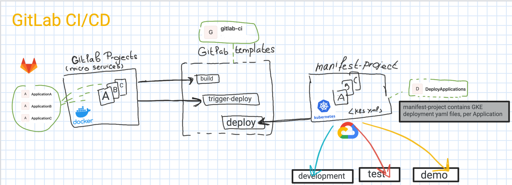

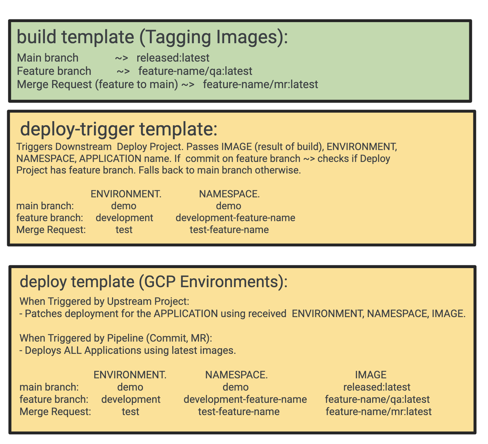

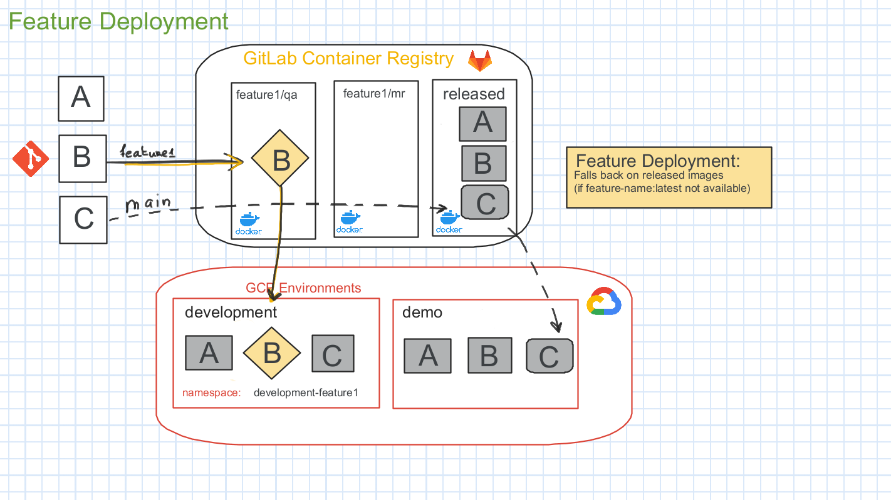

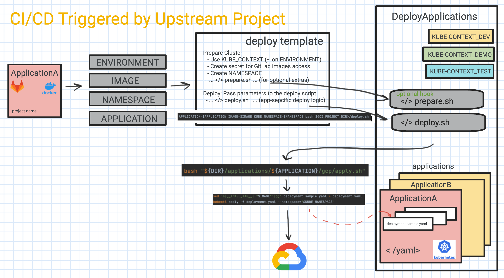

## Build
### Image Tagging Logic

Image Tagging and URL depends on the source branch or whetehr even is a merge request, in the following way:

- Main branch             ~>   released:latest  
- Feature branch         ~>   feature-name/qa:latest
- Merge Request (feature to main) ~>   feature-name/mr:latest

### Application CI file 

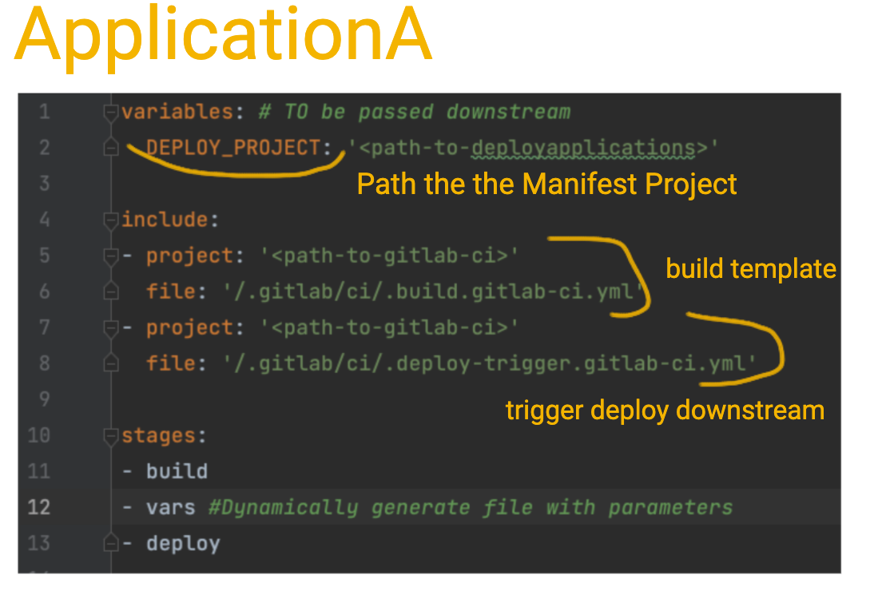

```shell
variables: # TO be passed downstream
  DEPLOY_PROJECT: '<path-to-deployapplications>'

include:
- project: '<path-to-gitlab-ci>'
  file: '/.gitlab/ci/.build.gitlab-ci.yml'
- project: '<path-to-gitlab-ci>'
  file: '/.gitlab/ci/.deploy-trigger.gitlab-ci.yml'

stages:
- build
- vars 
- deploy
```
## Deploy

### Triggered from Upstream
When deployment is triggered from the Upstream project, *gitlab-ci deploy Job* will call the  deploy.sh script from Manifest Project and pass required parameters:

```shell
APPLICATION=$APPLICATION IMAGE=$IMAGE KUBE_NAMESPACE=$NAMESPACE ENVIRONMENT=$ENVIRONMENT bash ${CI_PROJECT_DIR}/deploy.sh
```

### Triggered from Pipeline
When triggered from the pipeline, deployment iterates through the registered applications and uses latest image based on the following logic:
- If it is a main branch ~> uses released images
- If it is a feature branch ~> checks if there is a latest image for the feature branch of the application, or falls back to the released image
- If merge request ~> checks if there are any mr images in the container registry of the Application.

For an Application to be properly registered within the deployment automation following two steps need to be done:
- APPLICATION_NAMESPACE needs to be defined
- a folder needs to be added:  `applications/<application-name>` with the application-name matching GitLab project directory name from the URL (same as `CI_PROJECT_NAME`).
  *  The name of the directory for the project. For example if the project URL is gitlab.example.com/group-name/project-1, CI_PROJECT_NAME is project-1.

### Deploy CI file 
```shell
include:
  project: <path-to-gitlab-ci>
  file: /.gitlab/ci/.gitlab/ci/deploy.gitlab-ci.yml

variables:
  # Path to the Namespace of the Application(s) Projects with micro-services.
  # Assumption: All of them are under the same hierarchy and same namespace.
  APPLICATION_NAMESPACE: <path-to-application-namespace>

  # Could Point to the same AGENT
  KUBE_CONTEXT_DEMO: "<path-to-gitlab-agent-for-demo-env>"
  KUBE_CONTEXT_TEST: "<path-to-gitlab-agent-for-test-env>"
  KUBE_CONTEXT_DEV: "<path-to-gitlab-agent-for-dev-env>"

stages:
- deploy
- destroy

```

### Deploy script
The service specific logic needs to be added for the deployment to be executed, when deploy.sh is called by the `deploy` Job.

We are having the following structure for each of the registered applications inside applications/<application_name>:
- k8s  - contains required yaml files for the deployment
- gcp  - contains  logic to pass through parameters such as IMAGE

#### Examples:

**deploy.sh**
```shell
DIR="$( cd "$( dirname "${BASH_SOURCE[0]}" )" && pwd )"

if [ -n "$APPLICATION" ]; then
  APPLY_SCRIPT="${DIR}"/applications/"${APPLICATION}"/gcp/apply.sh
  if [ -f "${APPLY_SCRIPT}" ] ; then
    bash "$APPLY_SCRIPT"
  else
    echo  "Error: Invalid path to apply deployment $APPLY_SCRIPT"
  fi
else
  echo "Error, APPLICATION is not set"
fi

```
**apply.sh**
```shell
DIR="$( cd "$( dirname "${BASH_SOURCE[0]}" )" && pwd )"
echo "***** Applying  $APPLICATION deployment  *****"
K8S="$DIR/../k8s/"
sed 's|__IMAGE_TAG__|'"$IMAGE"'|g;' "$K8S/deployment.sample.yaml" > "$K8S/deployment.yaml"
kubectl apply -f "$K8S/deployment.yaml" --namespace="$KUBE_NAMESPACE"
kubectl apply -f "$K8S/service.yaml" --namespace="$KUBE_NAMESPACE" 
```

**deployment.sample.yaml**
```shell
apiVersion: apps/v1
kind: Deployment
metadata:
  labels:
    application: applicationa
  name: applicationa
spec:
  replicas: 1
  selector:
    matchLabels:
      application: applicationa
  template:
    metadata:
      labels:
        application: applicationa
    spec:
      containers:
      - image: __IMAGE_TAG__
        name: applicationa
        ports:
        - containerPort: 80
      imagePullSecrets:
      - name: regcred
      restartPolicy: Always
```
## Demo
### Setup
You will need following components:
- GCP Project with a GKE cluster
  * Provision GCP project and a GKE Cluster used for the deployment. It can be the same Project/Cluster for all environments (test, development, demo), or a dedicated (Cluster or Project) per environment.
- GitLab Projects:
  * Project for configuring  GitLab Agent and connecting to GCP Project
    * Instructions to Install GitLab Agent [here](https://docs.gitlab.com/ee/user/clusters/agent/install/index.html).
  * **gitlab-ci**: Project with [this gitlab-ci](https://github.com/evekhm/gitlab-ci.git) repository forked.
  * **ApplicationA**: Project with a forked source from this sample [nginx application](https://github.com/evekhm/applicationa.git).
    * Local Changes:
      * DEPLOY_PROJECT should point to the path of the GitLab  DeployApplications Project (created in the next step)
      * include project (Line 5 and Line 7) should point to the path of the gitlab-ci project (created in the previous step).
  * **DeployApplications**: Project with a forked source from this sample [DeployApplications](https://github.com/evekhm/DeployApplications.git).
    * Local Changes:
      * include project (Line 2) should point to the path of the gitlab-ci project.
      * APPLICATION_NAMESPACE (Line 9) should point to the path of the ApplicationA (see below)
      * GITLAB_AGENT (Line 12)  should point to the GitLab Agent path installed earlier.
    * When using Private Repositories, you will need to Add GITLAB_AUTH variable of File type to CI/CD Settings. This File is used to create `regcred ` secret to access image.
      * Generate  GitLab Token followings steps here with 'read registry' scope. 
      * Use generated token to get an auth file (for example, in the Terminal of the GCP Project):
      ```shell
        docker login -u <user_name> -p <gitlab_token> registry.gitlab.com
        cat $HOME/.docker/config.json
      ```
      * To instruct GKE to use secret when Pulling Images from GitLab repository, following lines to be added to the deployment yaml file:

     ```shell
        imagePullSecrets:
         - name: regcred
     ```


### Deployment to Demo
#### ApplicationA Pipeline
Commit to the main branch of the ApplicationA (or run the Pipeline manually)

- This will trigger building of the nginx image
- Triggering of the deployment with the built image tag 


Image is pushed to the ApplicationA GitLab Container Registry under `released`

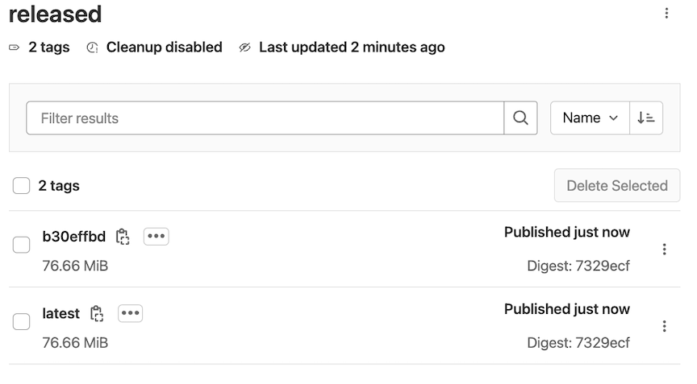

If you go yo yhe GCP Cluster -> Workloads, it shows the built image is used for deployment (same HASH number)
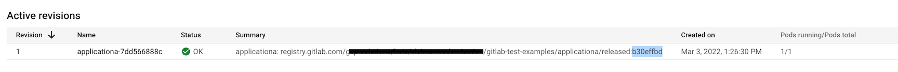

Got to Services/Ingress and by using external IP and Port navigate to the Application web page:
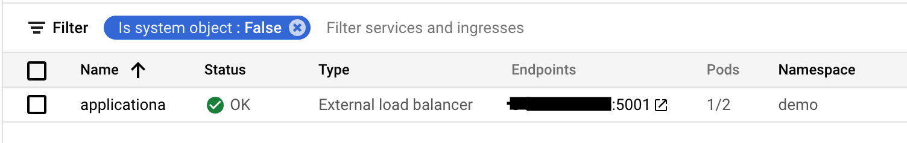

Here is our nginx deployment page:


#### DeployApplications PipeLine
Run Pipeline from  the DeployApplications Project

- This will trigger deployment of the registered ApplicationA using latest released image

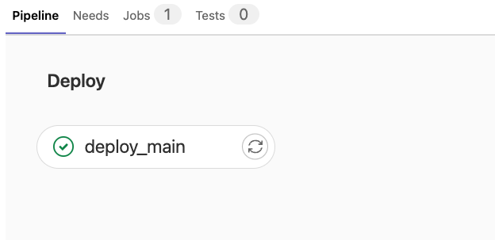

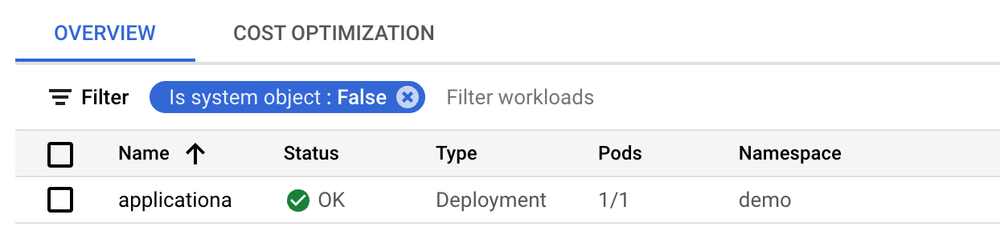

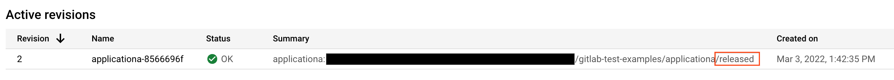

### Deployment to Development
Now lets say we want to make changes to ApplicationA. And if there were other services such as Application B and C - we would want to keep them as-is.

- branch-off ApplicationA and call it `feature1`
- make following changes to the file `ApplicationA/www/data/index.html` (line 7 and line 9) to change the text and background color

```shell
<!doctype html>
<html>
<head>
  <title>Hello nginx</title>
  <meta charset="utf-8" />
</head>
<body style="background-color:red;">
<h1>
  Hello World from Feature1!
</h1>
</body>
</html>
```

> Since we have not branched off DeployApplications, the ApplicationA Pipeline will trigger main branch of th DeployApplications project.
We could create feature1 branch for the DeployApplications and change KUBE_CONTEXT_DEV to deploy feature1 in a dedicated Project/Cluster.
We also could branch off any of the other applications/services and by naming branch the same name,   'feature1' in this case, we would direct modified image to the development environment with the namespace development-feature1.
By default, if there is no branch with that  name - latest released image is used for the deployment.

Image is pushed to the ApplicationA Gitlab Container Registry under `feature1/qa`
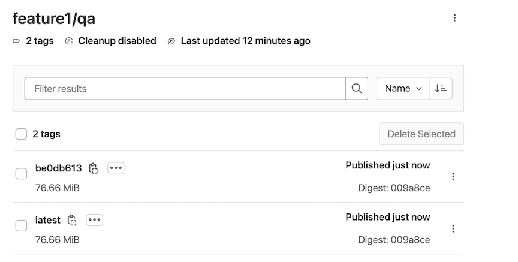


Now we have a new deployment in the `development-feature1` namespace:
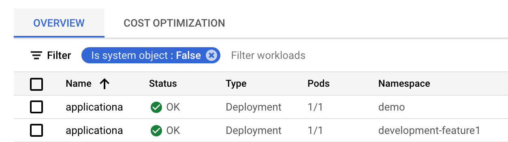

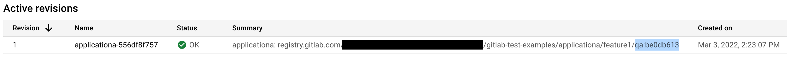

Go to Services/Ingress, select service in the development-feature1 namespace, and use IP and Port to open the Application's web page: 


Here is our nginx deployment page:


#### Changes to Development Environment
Let's say we want to have a standalone GCP Project and Cluster which is different from the demo/test setup.

- branch-off DeployApplications Project
- Change KUBE_CONTEXT_DEV to point to the desired Project/Cluster.
- Run the Pipeline 
  * A dedicated development deployment will be created and any further changes for ApplicationA will be re-directed to this environment.  

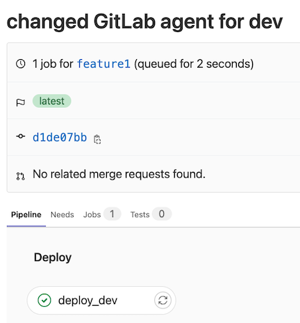

This triggered deployment into the new Project/Cluster using the latest image(s) for feature1

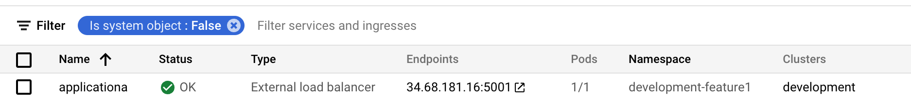

### Deployment To Test
Let's create a merge request and see how test environment will be initiated.

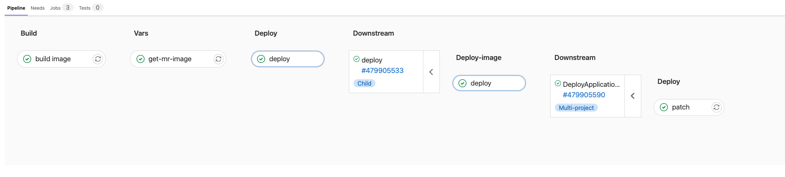

Image is pushed to the ApplicationA Gitlab Container Registry under `feature1/mr`
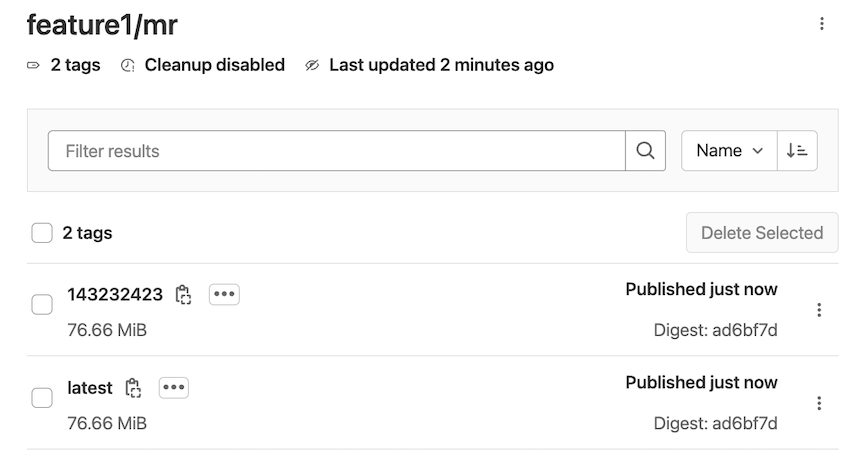

Deployed into `test-feature1` namespace:
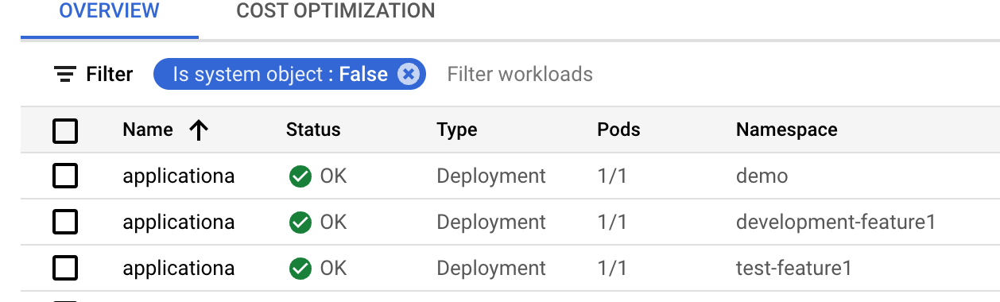


## GitLab Limitations

### Downstream Trigger
The following code, does not work when variable for the project is not defined as static, but needs to be substituted. To overcome this limitation, we are generating yaml file using `deploy-template.yml` on the fly.
```shell
  trigger:
    project: $DEPLOY_PROJECT
```

Must be:
```shell
  trigger:
    project: 'my-project-path'
```

### Pre-defined variables issue
Following variable is supposed to be set when Pipeline is triggered, however this is not the case. Instead, we introduce and use our own flag `PIPELINE_TRIGGERED`.

```shell
CI_PIPELINE_TRIGGERED
```

### Late Variable Binding
Rules and Variables have proved not to work too well, when variables are dynamic.
Because of that extra code needed to be added and in general usong of dynamic variables should be avoided. 

Because of that, I cannot easily extend rules and decide to skip execution of the job, if for-example KUBE_CONTEXT is empty, which would be an easy way for a user to decide, for example, not to deploy MR into test and skip that step.

The code snippet below would always skip the Job, because $KUBE_CONTEXT is not substituted as expected.
```shell
deploy_dev:
  environment: development
  rules:
  - if: '$KUBE_CONTEXT == null'
    when: never
```
