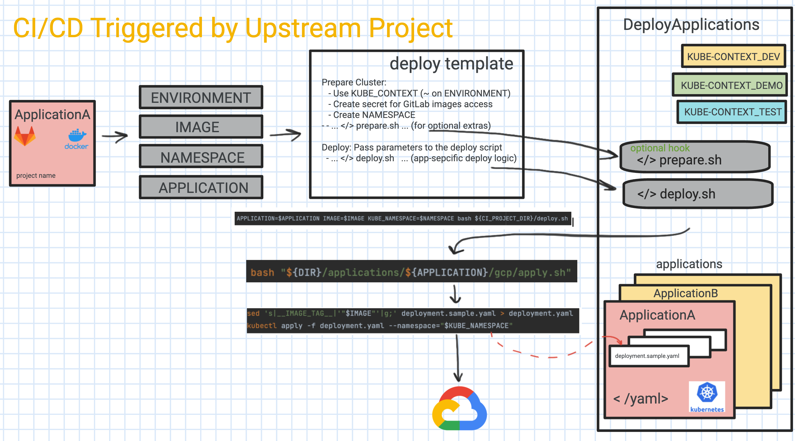

# GitLab CI Modules

##Table of Contents

## Table of Contents
- [Overview](#overview)
- [Setup](#setup)
  * [GitLab Projects](#gitlab-projects)
  * [CI/CD Environments](#ci-cd-environments)
- [GitLab Limitations](#gitlab-limitations)

## Overview

The goal of this CI/CD infrastructure is to leverage Gitlab integration with GCP and allow single Project to be used for different GCP deployments addressing the various personas needs.
The offered templates (modules) allow simplifying CI/CD while accounting for the complex micro-service architecture, when different services can be developed independently and kept in different projects. 


Use Cases:
1) As a *Customer Engineer*  I want to have an easy way to deploy Solution into my own GCP Project environment and use it to demo to a customer, while having full control over the GCP project.
2) As a *Developer*, I want to be able to work on the feature which spans across multiple projects and have automated CI/CD to deploy images that either belong to the feature and were modified by me, or the released versions. 
3) As a *QA engineer*, I want to be able to have MR related feature projects bee deployed into the test environment.
4) As a *Sales Person*, I want to have a stable demo environment for the customer presentations.
5) ...

## Setup
### GitLab Projects
We will demonstrate the usage of the plug-in templates with the following example of GitLab Projects setup:

**Services**: (different Projects, each has Container Registry enabled):
- ApplicationA - service A
- ApplicationB - service B
- ApplicationC - service C

**Manifest Project**:
- DeployApplications -  GCP deployment project, containing GKE manifests yaml file for the applications.

**Gitlab Templates**:
- [This]() Project, offering templates for building and deploying applications into the different GCP environment, while following the lifecycle of the solution development. 

### CI/CD Environments <a name="ci-cd-environments"></a>
CI/CD covers Following Environments:
- *development* environment(s) - personalized GCP environment(s), can be created/setup and used per developer.
- *test* environment - pre-configured GCP environment used for testing before manually releasing application images or changes to the project setup or deployment flow.
  The namespace separation (named after the feature branch) will be used during the deployment.
- *demo* - running stable demo using released images and main branch for the CI/CD deployment.





## GitLab Limitations

### Downstream Trigger
The following code, does not work when variable for the project is not defined as static, but needs to be substituted. To overcome this limitation, we are generating yaml file using `deploy-template.yml` on the fly.
```shell
  trigger:
    project: $DEPLOY_PROJECT
```

Must be:
```shell
  trigger:
    project: 'my-project-path'
```

### Pre-defined variables issue
Following variable is supposed to be set when Pipeline is triggered, however this is not the case. Instead, we introduce and use our own flag `PIPELINE_TRIGGERED`.

```shell
CI_PIPELINE_TRIGGERED
```
